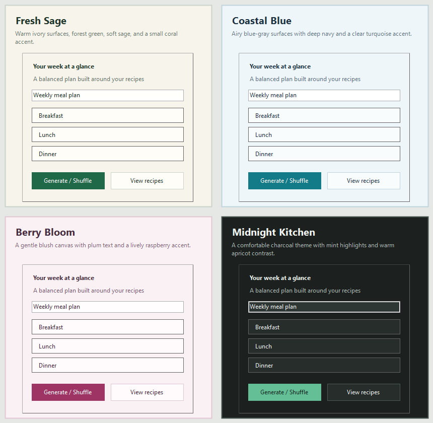

## Diet Planner
Simple Diet Planner made with Visual Basic and Windows Forms for personal use.

Recipe pages are parsed locally and sent to Codex CLI for structured nutrition and
meal-type extraction, including ingredient amounts and preparation directions.
DietPlanner installs the native Windows Codex CLI on demand when it is missing and
uses the user's ChatGPT sign-in; no API-key file is needed. Existing recipes
without meal types are categorized automatically on startup. Legacy recipes that
do not yet have ingredients and preparation directions are also enriched from
their saved source URL.

Every meal records its advanced-scrape status as `Pending`, `Complete`, or
`Unavailable`. Clearly invalid, inaccessible, or incomplete recipe sources are
marked `Unavailable` and skipped on future launches. Transient network or Codex
failures remain `Pending` so they can be retried later.

Scraped directions arrive as ordered Preparation and Cooking step arrays.
DietPlanner formats the headings, numbering, punctuation, and line breaks locally.

The main window can plan a complete Monday-through-Sunday week in either of two
modes:

1. Use only checked recipes and include every checked recipe at least once.
2. Generate freely from the full catalog while guaranteeing any checked recipes
   at least once.

All five meal-type slots are filled each day. Each click creates a fresh randomized
shuffle, then balances the saved recommended daily nutrient targets across the
week while penalizing large day-to-day calorie or nutrient variance. The generated
plan, mode, random seed, guaranteed recipes, and target snapshot are saved in
`data/week-plan.json`.

Settings includes four persistent themes with live preview: Fresh Sage, Coastal
Blue, Berry Bloom, and Midnight Kitchen. The preference is stored in
`data/settings.json`, which is preserved during automatic updates.

`View All Recipes` provides an editable category matrix for the full recipe
catalog. Breakfast always implies Brunch. A one-time category migration also asks
Codex to apply Brunch more broadly to suitable Lunch and Snack recipes, after
which manual category edits remain authoritative.

Daily Facts refreshes in place after recommended-intake changes. Nutrient units
remain display formatting, so saving a selected or actively edited `g`/`mg` cell
continues to persist its numeric value correctly.

The app runs `gpt-5.6-luna` with low reasoning in Fast mode. Codex CLI is the local
Windows client, while model inference still uses OpenAI's hosted service. On the
first Codex-backed action, DietPlanner:

1. Runs OpenAI's official PowerShell installer if `codex.exe` is not found.
2. Opens the Codex browser sign-in flow if no ChatGPT login is available.
3. Runs `codex exec` with a strict JSON output schema in a read-only temporary
   workspace.

For direct CLI use, the prompt to `codex exec` is positional. The `-p` option
selects a named Codex profile; it does not mean “prompt.”

Release builds check this repository's latest GitHub Release on startup. When a
newer version is available, DietPlanner verifies the release's SHA-256 checksum,
stages it, closes, replaces the application files, and restarts automatically.
Saved files in the application's `data` directory are preserved. If replacement
fails, the updater restores its backup and does not retry that same release on
every launch.
